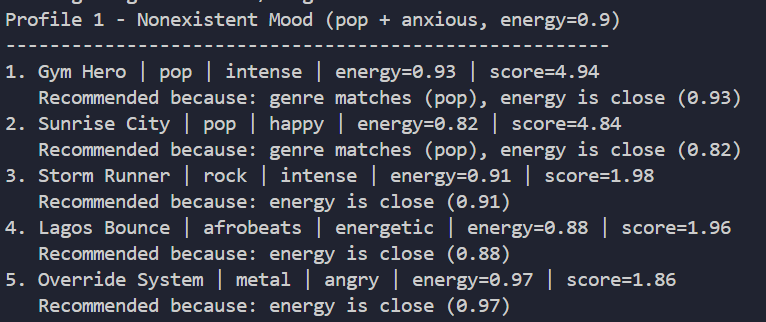
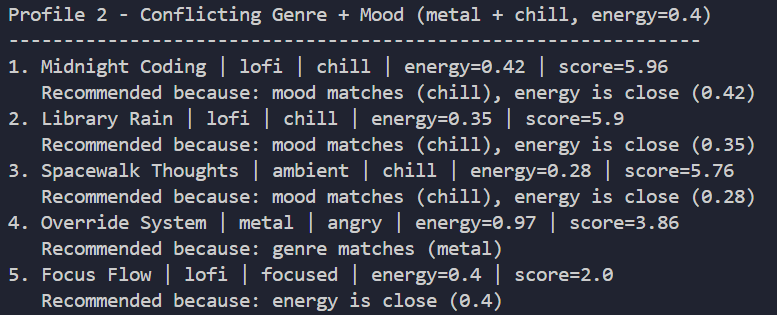
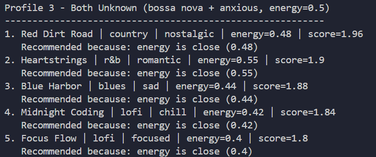
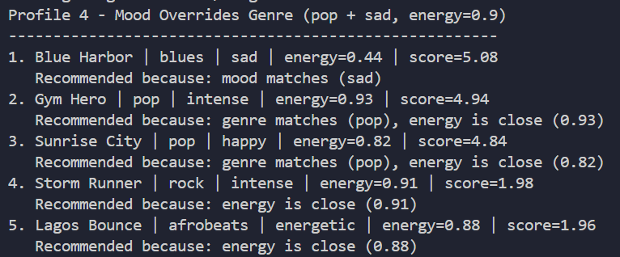
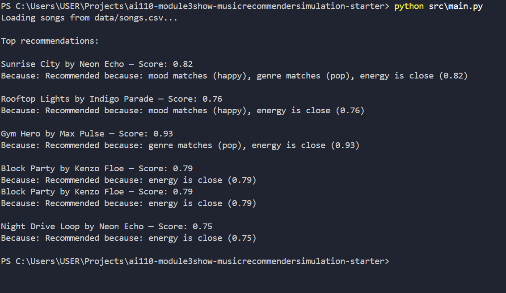

# 🎵 Music Recommender Simulation

## Project Summary

In this project you will build and explain a small music recommender system.

Your goal is to:

- Represent songs and a user "taste profile" as data
- Design a scoring rule that turns that data into recommendations
- Evaluate what your system gets right and wrong
- Reflect on how this mirrors real world AI recommenders

Replace this paragraph with your own summary of what your version does.

---

## How The System Works

### System Flow

```
Input (UserProfile) → Load all songs → Pre-filter candidates → Score each candidate → Rank by score → Explain → Output
```

### What Each Song Stores

Each `Song` tracks: `genre`, `mood`, `energy`, `tempo_bpm`, `valence`, `danceability`, `acousticness`, and `instrumentalness`.

The three features actively used in scoring are **mood**, **genre**, and **energy**. The rest are stored but not yet scored — available for future improvements.

### What the UserProfile Stores

`favorite_genre`, `favorite_mood`, `target_energy`, and `likes_acoustic`.

### Algorithm Recipe

1. **Load** — Read all songs from `songs.csv` into memory as `Song` objects.
2. **Pre-filter** — Keep only songs that match the user's mood **or** genre. If fewer candidates than `k` remain, fall back to all songs so we always return a full list.
3. **Score** each candidate (starts at 0):
   - Mood match → **+4.0** (highest weight — mood drives listening context more than genre)
   - Genre match → **+3.0**
   - Energy closeness → `(1.0 - abs(song.energy - user.target_energy)) * 2.0` — max **+2.0**
4. **Rank** — Sort all scored candidates in descending order, return top `k`.
5. **Explain** — For each result, generate a plain-language reason based on which features matched.

### Filtering Approach: Context-Based

This system uses **context-based filtering** — it recommends songs similar to what the user says they like, based on features like mood and genre. It does not use **collaborative filtering** (what other users liked), which is the second layer real-world systems like Spotify add on top.

### Potential Biases

- **Mood dominance** — Mood carries the most weight (+4.0). A song that perfectly matches genre and energy but not mood will almost always rank below a mood-match, even if it's a better fit overall.
- **Pre-filter blind spots** — Songs that don't match on mood or genre are eliminated early. A great song that fits the user's energy perfectly but belongs to an unexpected genre will never be scored unless the fallback triggers.
- **Energy is the only numeric feature scored** — Tempo, danceability, and valence are ignored in scoring. A slow, low-danceability song can score the same as a high-energy dance track if genre and mood match.
- **No personalization over time** — Every recommendation starts fresh. The system has no memory of what the user skipped or replayed, so it can't improve from feedback.

---

## Getting Started

### Setup

1. Create a virtual environment (optional but recommended):

   ```bash
   python -m venv .venv
   source .venv/bin/activate      # Mac or Linux
   .venv\Scripts\activate         # Windows

2. Install dependencies

```bash
pip install -r requirements.txt
```

3. Run the app:

```bash
python -m src.main
```

### Running Tests

Run the starter tests with:

```bash
pytest
```

You can add more tests in `tests/test_recommender.py`.

---

## System Evaluation — Adversarial Profiles

Four edge-case user profiles were designed to stress-test the scoring logic and expose unexpected behaviour.

---

### Profile 1 — Nonexistent Mood (`pop` + `anxious`, energy 0.9)

**What it tests:** When the user's mood doesn't exist in the catalog, only genre and energy drive scoring.

**Expected:** Pop songs surface at the top via genre bonus alone.

**What happened:** Pop songs ranked #1 and #2 as expected, but the large gap between their scores (~4.9) and everything else (~2.0) shows how much scoring power a mood match would have added.



---

### Profile 2 — Conflicting Genre + Mood (`metal` + `chill`, energy 0.4)

**What it tests:** Genre and mood point in opposite directions — metal implies aggression, chill implies calm.

**Expected:** Unclear which dimension "wins."

**What happened:** Mood weight (4.0) dominated genre weight (3.0). Three lofi/ambient songs ranked #1–3. The lone metal song ranked #4. A self-described metal fan who is currently chill gets zero metal in their top 3.



---

### Profile 3 — Both Preferences Unknown (`bossa nova` + `anxious`, energy 0.5)

**What it tests:** Neither genre nor mood exists in the catalog, so no bonus is ever awarded.

**Expected:** The recommender falls back to pure energy proximity.

**What happened:** All scores clustered between 1.80–1.96 (max possible is 2.0). Results came from five completely different genres (country, r&b, blues, lofi). The system essentially becomes a random energy-proximity picker with no taste signal.



---

### Profile 4 — Mood Overrides Genre (`pop` + `sad`, energy 0.9)

**What it tests:** Genre and mood both exist but belong to totally different songs.

**Expected:** Pop songs rank at the top since the user declared pop as their genre.

**What happened (adversarial surprise):** A blues/sad song ranked #1 (score 5.08) ahead of all pop songs (4.94, 4.84). The mood bonus alone was enough to beat genre + energy combined. A "pop fan who wants sad music" gets a blues song first.



---

## Experiments You Tried

Use this section to document the experiments you ran. For example:

- What happened when you changed the weight on genre from 2.0 to 0.5
- What happened when you added tempo or valence to the score
- How did your system behave for different types of users

---

## Limitations and Risks

- **Mood dominates genre.** The mood score (+4.0) outweighs the genre score (+1.5–3.0), so a user who says they like pop but are feeling sad right now will get a blues song at #1 — ahead of every pop song. Mood overrides the user's stated long-term taste.
- **Single-song moods leave no real choice.** 11 of 14 moods in the catalog appear on exactly one song. For moods like "nostalgic" or "romantic", the mood bonus fires on only one track, locking it in as #1 regardless of how poorly it fits everything else.
- **The pre-filter silently hides songs.** Songs that don't match on mood or genre are eliminated before scoring even starts. A perfectly matched song in an unexpected genre is invisible to the user — no explanation is ever generated for why it was excluded.
- **Only 18 songs.** The catalog is too small for meaningful diversity. Multiple user profiles produce the same top results because there simply aren't enough songs to differentiate between different tastes.
- **No memory or feedback loop.** Every session starts fresh. The system cannot learn from what the user skipped or replayed, so it cannot improve over time.

You will go deeper on this in your model card.

---

## Reflection

Read and complete `model_card.md`:

[**Model Card**](model_card.md)

The clearest thing this project taught me about how recommenders turn data into predictions: the weights you assign are not just numbers, they are decisions about what matters more. Giving mood a score of +4.0 and genre a score of +1.5 sounds like a small technical choice, but it meant that a user's emotional state at a given moment carries almost three times more influence than their long-term musical identity. You do not see that tradeoff until you run the system on a user whose mood and genre disagree — and then it becomes impossible to miss.

Bias in this kind of system does not look like an error. The "pop + sad → blues #1" result was not a bug. The system did exactly what it was designed to do. That is what makes bias hard to catch: it shows up as correct behavior that produces unfair outcomes for specific users. In this case, the system quietly disadvantaged anyone whose current emotional state differs from their usual taste — a real pattern that would affect a large portion of real users. The only way to find it was to deliberately test a profile designed to break the assumptions, which is why adversarial testing matters even for simple systems.


---

## 7. `model_card_template.md`

Combines reflection and model card framing from the Module 3 guidance. :contentReference[oaicite:2]{index=2}  

```markdown
# 🎧 Model Card - Music Recommender Simulation

## 1. Model Name

Give your recommender a name, for example:

> VibeFinder 1.0

---

## 2. Intended Use

- What is this system trying to do
- Who is it for

Example:

> This model suggests 3 to 5 songs from a small catalog based on a user's preferred genre, mood, and energy level. It is for classroom exploration only, not for real users.

---

## 3. How It Works (Short Explanation)

Describe your scoring logic in plain language.

- What features of each song does it consider
- What information about the user does it use
- How does it turn those into a number

Try to avoid code in this section, treat it like an explanation to a non programmer.

---

## 4. Data

Describe your dataset.

- How many songs are in `data/songs.csv`
- Did you add or remove any songs
- What kinds of genres or moods are represented
- Whose taste does this data mostly reflect

---

## 5. Strengths

Where does your recommender work well

You can think about:
- Situations where the top results "felt right"
- Particular user profiles it served well
- Simplicity or transparency benefits

---

## 6. Limitations and Bias

Where does your recommender struggle

Some prompts:
- Does it ignore some genres or moods
- Does it treat all users as if they have the same taste shape
- Is it biased toward high energy or one genre by default
- How could this be unfair if used in a real product

---

## 7. Evaluation

How did you check your system

Examples:
- You tried multiple user profiles and wrote down whether the results matched your expectations
- You compared your simulation to what a real app like Spotify or YouTube tends to recommend
- You wrote tests for your scoring logic

You do not need a numeric metric, but if you used one, explain what it measures.

---

## 8. Future Work

If you had more time, how would you improve this recommender

Examples:

- Add support for multiple users and "group vibe" recommendations
- Balance diversity of songs instead of always picking the closest match
- Use more features, like tempo ranges or lyric themes

---

## 9. Personal Reflection

A few sentences about what you learned:

- What surprised you about how your system behaved
- How did building this change how you think about real music recommenders
- Where do you think human judgment still matters, even if the model seems "smart"

## Terminal Image
